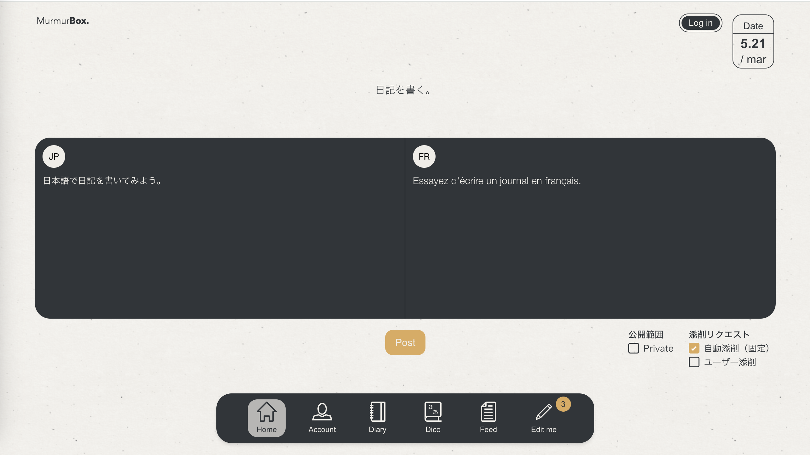

# MurmurBox.

## Introduction

MurmurBox. is an application that supports language learning through a diary.
It is especially designed for Japanese users who are learning French.
Users write a diary in French and learn French through automatic correction by AI and a peer-learning system with other users.

## Table of Contents

- [Features](#features)
- [Getting Started](#getting-started)
- [Usage](#usage)
- [Technology Stack](#technology-stack)
- [Authors](#authors)

## Features

MurmurBox. offers the following features:

Main Features
- AI Diary Correction:
Users can write diaries in Japanese and French, and AI provides a sample French output. Users can compare their own French diary with the sample to learn and improve.

- Peer Review:
Users can review each other's diaries. By correcting other users' diaries, they can learn and stay motivated within the community.

Additional Features
- Login: Users can securely log in using Google authentication.
- User Settings: You can set your username and display icon.
- Commenting: Users can comment on diaries.

Each feature is designed with the user experience in mind, offering a unique environment that supports language learning through interaction and AI assistance.

## Getting Started

This application is built with Vue.js for the frontend, Node.js and Express for the backend, and Firestore as the database. It also uses the DeepL API for feedback on sample diaries and Firebase Storage for storage.

### Prerequisites

- Node.js version 18.16.0 or above
- Vue.js
- Firebase Account (for Firestore and Firebase Storage)
- DeepL API Key

## Usage

Here's how to use the main features of MurmurBox:

## Technology Stack

This project has been created using:

### Frontend:
- [Vue.js](https://vuejs.org/)
- [Vite](https://vitejs.dev/)

### Backend:
- [Node.js](https://nodejs.org/)
- [Express](https://expressjs.com/)

### Database:
- [Firestore](https://firebase.google.com/products/firestore)
- [Firebase Storage](https://firebase.google.com/products/storage)

### Third-Party Services:
- DeepL API(https://www.deepl.com/docs-api)

## Authors

**Yoko ONO**
- GitHub: [ydroal](https://github.com/ydroal)
